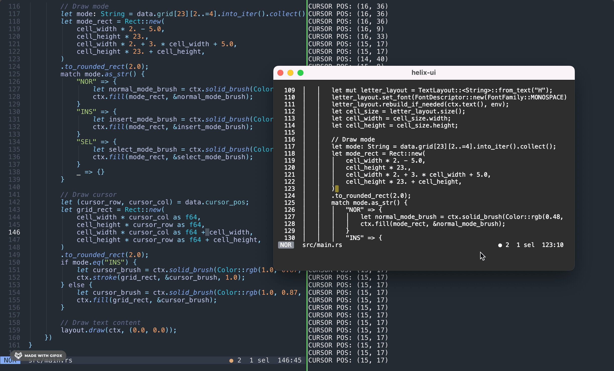

# Helix UI (POC)

A GUI client for the [Helix editor](https://github.com/helix-editor/helix). It works by capturing and re-render the stdout of the TTY when Helix is running.

Screenshot: _Helix-UI editing its own source code_ :P

Some UI features can be implemented on top of it, for example, the rounded corner cursor and the editing mode badge.

This is by no mean a good approach to implement UI, but it works. The right way to do this should be interacting with the actual rendering protocol.

**Note:** To run this program, make sure you have helix installed at **/usr/local/bin/hx**, if the location on your machine is different, change it before compile.

---

This piece of POC is [UNLICENSED](https://unlicense.org/), please feel free to do whatever you want with it.
